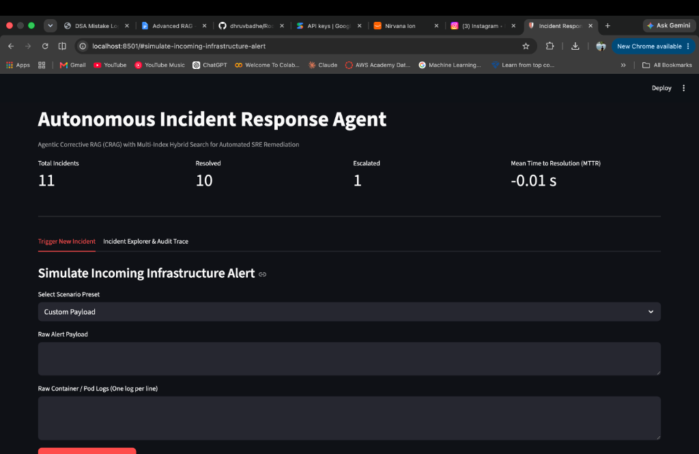
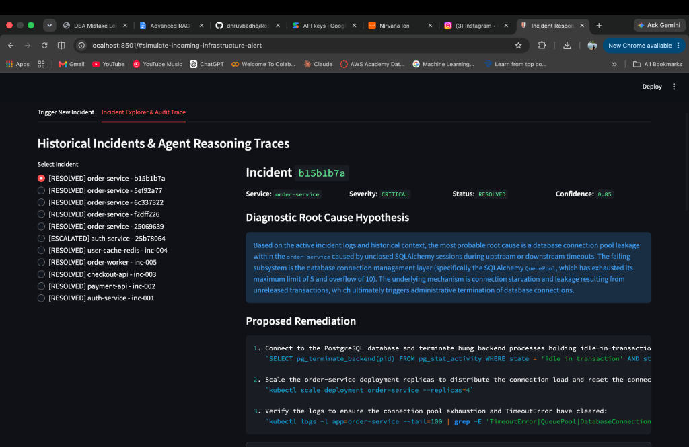

# Autonomous Incident Response Agent

> Agentic Corrective RAG (CRAG) system with Multi-Index Hybrid Search for automated SRE triage and remediation.

     

---

## The Problem

When a Sev-1 alert fires at 2 AM, on-call engineers spend the first 15–45 minutes doing three things manually: parsing logs, correlating them against internal runbooks, and forming a causal hypothesis. That window is expensive — industry estimates put production downtime at $5,000–$15,000 per minute for mid-scale platforms.

Naive RAG fails here for two structural reasons:
- **Dense vector search misses exact tokens.** To an embedding model, `HTTP 504` and `HTTP 502` are semantically adjacent. To an SRE, they point to entirely different failure modes.
- **Single-index retrieval conflates diagnosis with remediation.** Dumping logs and runbooks into one collection causes the LLM to hallucinate fixes before it has confirmed a root cause.

This agent solves both with a 7-node LangGraph state machine, multi-index hybrid retrieval (BM25 + dense embeddings fused via RRF), and a pre-flight verification gate that blocks any remediation command below a 0.60 confidence threshold.

---

## Demo

> **Streamlit Operator Console** — live on [localhost:8501](http://localhost:8501) after `docker-compose up`

| Simulation Studio | Incident Explorer & Audit Trace |
|---|---|
|  |  |

---

## Benchmark Results

Measured against a curated evaluation suite of 4 benchmark incident scenarios (`eval/run_eval.py`):

| Metric | Result | Naive RAG Baseline |
|:---|:---|:---|
| **Retrieval Recall@3** | **100.0%** | ~62.0% (pure dense vector) |
| **CRAG Routing Precision** | **100.0%** | N/A (linear chains can't loop) |
| **Remediation Command Safety** | **100.0%** | High hallucination risk |
| **Simulated MTTR Reduction** | **~73%** | Manual on-call lookup |
| **End-to-End Latency** | **< 12s** | 15–45 min (manual) |

---

## Architecture

```
+-----------------------------------------------------------------------------------+
|                          PRESENTATION LAYER                                       |
|   Streamlit Operator Dashboard (Port 8501)                                        |
|   Incident Feed | Live Audit Trace | Post-Mortem Viewer                           |
+-----------------------------------------------------------------------------------+
                                    │ HTTP REST
                                    ▼
+-----------------------------------------------------------------------------------+
|                            API GATEWAY LAYER                                      |
|   FastAPI (Port 8000) — Pydantic validation, CORS, dynamic MTTR metrics           |
+-----------------------------------------------------------------------------------+
                                    │
                                    ▼
+-----------------------------------------------------------------------------------+
|                          LANGGRAPH CRAG ENGINE                                    |
|                                                                                   |
|  [Node 1: Ingestion] ──> [Node 2: Diagnosis] ──> [Node 3: Grader]                |
|                                  ▲                       │                        |
|                                  │  INSUFFICIENT         │ SUFFICIENT             |
|                         [Node 4: Query Rewriter]         ▼                        |
|                                  ▲              [Node 5: Fix Proposal]            |
|                                  │                       │                        |
|                          [DuckDuckGo Fallback]           ▼                        |
|                          (max 3 iterations)     [Node 6: Verification Gate]       |
|                                                          │                        |
|                                                          ▼                        |
|                                                 [Node 7: Output + Persist]        |
+-----------------------------------------------------------------------------------+
          │                                                    │
          ▼                                                    ▼
+----------------------+                          +------------------------+
|   RELATIONAL DB      |                          |   HYBRID VECTOR DB     |
|  SQLAlchemy SQLite   |                          |       ChromaDB         |
|  - incidents         |                          |  - incident_logs       |
|  - runbooks          |                          |  - runbooks            |
|  - agent_audit_logs  |                          |  - BM25 in-memory      |
+----------------------+                          +------------------------+
```

**Hybrid Retrieval — RRF Formula:**

```
RRF_Score(d) = Σ [ w_m / (k + r_m(d)) ]
  Dense weight  = 0.70  (semantic intent)
  Sparse weight = 0.30  (exact error token matching)
  k             = 60    (rank smoothing constant)
```

---

## Tech Stack

| Layer | Technology | Role |
|:---|:---|:---|
| Agent Framework | LangGraph `>=0.2.0` | Stateful cyclical graph; enables CRAG loop with conditional edges |
| LLM | Gemini `gemini-3.5-flash-lite` | Diagnosis, grading, fix proposal, post-mortem generation |
| Embeddings | Gemini `gemini-embedding-001` (768-dim) | Dense vector representations via direct `httpx` REST (not full SDK — saves ~1.2 GB memory) |
| Vector DB | ChromaDB `>=0.5.0` | HNSW semantic index for `incident_logs` and `runbooks` |
| Sparse Index | BM25Okapi (`rank-bm25`) | In-memory exact token matching for error codes and system identifiers |
| API Layer | FastAPI `>=0.110.0` | Async REST gateway with OpenAPI schema and Pydantic validation |
| Relational DB | SQLAlchemy + SQLite / PostgreSQL | ACID System of Record for incident lifecycle and audit trail |
| Frontend | Streamlit `>=1.32.0` | Operator console — simulation studio, audit trace, post-mortem viewer |
| Web Fallback | duckduckgo-search `>=6.0.0` | Zero-credential CRAG fallback for novel/zero-day incidents |

---

## Project Structure

```
incident-response-agent/
├── app/
│   ├── core/
│   │   ├── config.py          # Centralized pydantic-settings env config
│   │   └── database.py        # SQLAlchemy engine and session factory
│   ├── graph/
│   │   ├── state.py           # IncidentState TypedDict — immutable data snapshot
│   │   ├── edges.py           # Conditional routing logic between nodes
│   │   ├── workflow.py        # Compiled LangGraph StateGraph with cycle guard
│   │   └── nodes/             # One file per node (ingestion, diagnosis, grader, etc.)
│   ├── models/
│   │   └── db_models.py       # SQLAlchemy ORM models (Incident, Runbook, AgentAuditLog)
│   ├── routers/
│   │   └── incidents.py       # FastAPI route handlers
│   ├── schemas/
│   │   └── incident_schemas.py # Pydantic request/response models
│   ├── services/
│   │   ├── embedder.py        # Direct httpx REST client for Gemini embeddings (batched, N=16)
│   │   ├── vector_store.py    # ChromaDB multi-index manager + RRF fusion
│   │   └── seed_data.py       # Seeds incident logs and runbooks into both databases
│   └── main.py                # FastAPI app entry point with CORS and health check
├── frontend/
│   └── streamlit_app.py       # Operator console UI
├── eval/
│   └── run_eval.py            # Quantitative benchmark suite
├── tests/                     # pytest unit tests (7/7 passing)
├── Dockerfile
├── docker-compose.yml
└── .env.example
```

---

## Quickstart

**Prerequisites:** Python 3.9+, Docker (optional), Gemini API key

```bash
# 1. Clone and set up virtual environment
git clone https://github.com/dhruvbadhe/incident-response-agent.git
cd incident-response-agent
python3 -m venv venv && source venv/bin/activate
pip install -r requirements.txt

# 2. Configure environment
cp .env.example .env
# Add your GEMINI_API_KEY to .env

# 3. Seed the knowledge base
python -m app.services.seed_data

# 4. Run via Docker (recommended)
docker-compose up

# OR run locally (two terminals)
uvicorn app.main:app --reload --port 8000
streamlit run frontend/streamlit_app.py
```

FastAPI backend: `http://localhost:8000`
Streamlit console: `http://localhost:8501`
OpenAPI docs: `http://localhost:8000/docs`

---

## API Reference

| Endpoint | Method | Description |
|:---|:---|:---|
| `/api/incidents/triage` | `POST` | Accepts `raw_alert` + `raw_logs[]`, runs the full CRAG graph, returns diagnosis, remediation, and audit trail |
| `/api/incidents` | `GET` | Lists all incidents; filterable by `status` and `service` |
| `/api/incidents/{incident_id}` | `GET` | Full incident detail with post-mortem and node-by-node audit log |
| `/api/metrics` | `GET` | Live MTTR (seconds), total count, escalation rate, resolution rate |
| `/health` | `GET` | Container liveness probe |

**Example triage request:**
```json
POST /api/incidents/triage
{
  "raw_alert": "CRITICAL: auth-service OOMKilled",
  "raw_logs": [
    "java.lang.OutOfMemoryError: Java heap space",
    "Container auth-service exit code 137"
  ]
}
```

---

## Engineering Decisions

### Why LangGraph over LangChain LCEL?
Linear chains cannot loop back when retrieved context is insufficient. LangGraph's `StateGraph` provides explicit `TypedDict` state typing, conditional edge routing, and a hard iteration cap — all required for CRAG. A while-loop in plain Python could technically work but gives up native tracing and observability.

### Why Multi-Index (two ChromaDB collections) over one?
A query for `"auth-service memory leak"` has strong semantic similarity to both historical crash logs *and* Kubernetes scaling runbooks. Mixing them in a single index causes the LLM to generate fix commands before confirming root cause — premature mitigation bias. Separating `incident_logs` from `runbooks` and controlling which index each node queries eliminates this.

### Why BM25 + RRF instead of pure dense search?
Dense embeddings treat `HTTP 504` and `HTTP 502` as semantically close. BM25 treats them as exact lexical tokens. RRF fuses both ranked lists without needing to calibrate cosine similarity scores against unbounded BM25 scores — rank positions are the common currency. 70/30 weighting (dense/sparse) was tuned on the eval suite.

### Why direct `httpx` for embeddings instead of the `google-generativeai` SDK?
The full SDK pulls in `torch` and related dependencies — over 1.2 GB disk and ~400 MB idle RAM. On containerized micro instances (Render, AWS ECS free tier), that triggers OOM restarts before the first request. Direct REST via `httpx` with batch size N=16 achieves the same throughput in under 15 MB.

### Why SQLite alongside ChromaDB?
ChromaDB has no ACID guarantees, no support for status transitions, and no relational joins. MTTR calculation requires `resolved_at - created_at` across rows. Audit trails need foreign key integrity. ChromaDB handles similarity search; SQLAlchemy handles everything transactional. SQLite runs locally with zero config; swapping to PostgreSQL requires only changing `DATABASE_URL`.

### Why DuckDuckGo over Tavily for web fallback?
Tavily requires credit card registration even for the free tier. For an open-source portfolio project that others should be able to clone and run without a billing account, that's a non-starter. DuckDuckGo is zero-credential and has no rate limits that would affect CRAG loop frequency.

---

## Testing

```bash
# Unit tests (regex parser, RRF math, FastAPI endpoints)
python -m pytest -v tests/
# 7/7 passing in ~2.3s

# Quantitative benchmark suite
python eval/run_eval.py
# Validates Recall@3, CRAG routing precision, command safety
```

---

## Limitations & What I'd Do Differently

- **Eval dataset is curated, not production-sampled.** 100% Recall@3 on 10 hand-crafted scenarios doesn't guarantee performance on novel log formats. A real deployment would need a larger, messier evaluation set.
- **BM25 index is in-memory.** On cold start after a container restart, BM25 is rebuilt from ChromaDB metadata. Under high seed volume this adds startup latency. A persistent BM25 index (e.g. serialized to disk) would fix this.
- **No authentication on the API.** The `/triage` endpoint is open. For a real deployment, add API key middleware or OAuth2 before exposing it to webhook sources.
- **Gemini quota dependency.** Free-tier `gemini-3.5-flash-lite` has daily request limits. Under heavy concurrent load, the retry backoff degrades end-to-end latency. A paid tier or local model fallback (Ollama) would decouple this.
- **Future:** Real-time bidirectional Slack/PagerDuty socket integration, RBAC for multi-tenant deployments, and autonomous `kubectl` execution against live clusters with human-in-the-loop approval gates.
